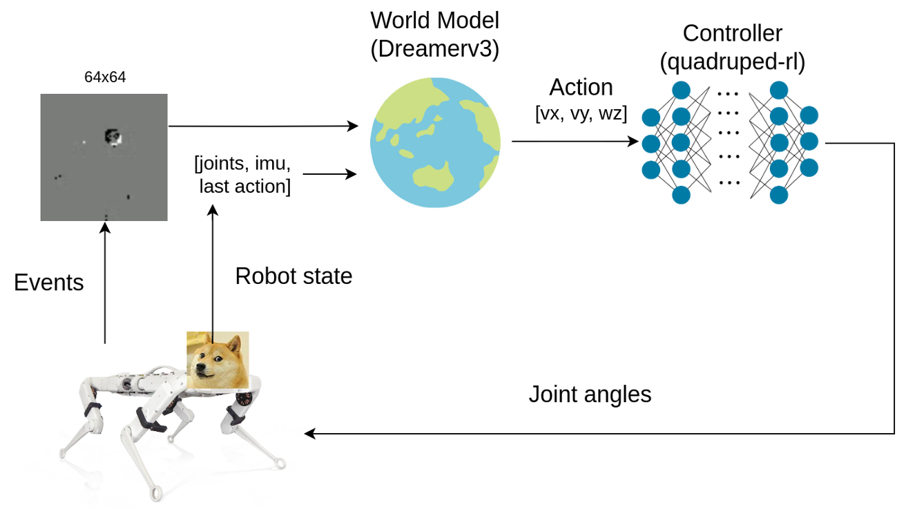
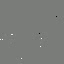
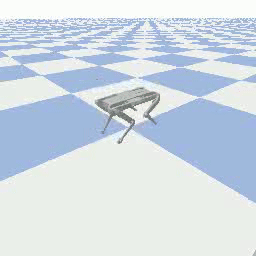

# DOGE : Dynamic Obstacle Ground-based Evasion

This repository contains a complete research and experimentation framework built on **ROS 2** and **MuJoCo** for learning **dynamic projectile evasion** with the **Solo12** quadruped robot.

The key design goal of this project is **high-speed reactivity**:

* **Perception:** Utilizing an **event-based camera** to track fast-moving objects with microsecond latency.
* **Agility:** Moving beyond static path planning by using **Model-Based Reinforcement Learning (DreamerV3)**.
* **Real-Time:** Integrating high-frequency motor control (100Hz) with the neuromorphic vision system.

<div align="center">
    
</div>

## Table of Contents

* [Prerequisites](#prerequisites)
* [Installation](#installation)
* [Usage](#usage)
* [Results & Limitations](#results--limitations)

## Prerequisites

This project assumes **familiarity with ROS 2 and Reinforcement Learning**.

Before working with this repository, you should:

* Have **ROS 2 Humble** installed on Ubuntu 22.04
* Have **MuJoCo** installed for simulation
* Have a Python environment with PyTorch and standard RL libraries

## Installation
Clone the repository using the following command:
```bash
git clone --recurse-submodules https://github.com/Telios/doge.git
```

Make a new conda environment and install the required packages using the following commands:
```bash
conda env create -f environment.yml
conda activate doge
```

Install the external libraries
```bash
./install_external.sh
```

## Usage

First you need to calibrate the robot.

```bash
bash scripts/calibrate.sh
```

To run doge with Solo12, use the following command:
```bash
bash scripts/run_doge.sh
```

Follow the instructions in the terminal to start doge.

## Results & Limitations

<div align="center">
  <div style="width: 50%; margin: 6px 0; margin-bottom: 24px;float: left;">
       
         <p>Simulation results from the event-based camera</p>
  </div>
  <div style="width: 50%; margin: 6px 0; margin-bottom: 24px; float: left;">
        
          <p>Simulation results in Mujoco</p>
  </div>
</div>

* **Simulation Success**: The DreamerV3 agent successfully learned a robust policy in simulation, capable of consistently dodging incoming projectiles by coordinating body movement and orientation.


* **Sim-to-Real Challenges**: While the policy performed well in simulation, the direct transfer to the physical Solo12 robot faced a significant sim-to-real gap. The real-world physics and sensor noise profiles proved distinct enough that the policy requires further refinement.
* **Future Work**: Identifying pathways for bridging this gap include more aggressive domain randomization and sophisticated reward shaping to encourage more stable real-world behaviors.